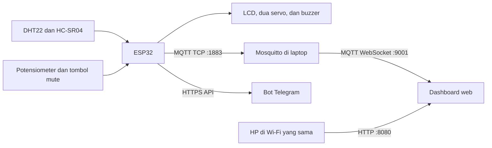

# Sedia Aku Sebelum Banjir

Sistem peringatan dini berbasis ESP32 untuk memantau jarak air (atau jarak objek), suhu, dan kelembapan. Ketika jarak kurang dari **20 cm**, sistem mengunci dua servo ke 90°, menyalakan sirene evakuasi bertipe *wail*, mengirim notifikasi Telegram, dan menerbitkan status ke MQTT. Status dapat dipantau melalui dashboard web pada jaringan lokal.

## Fitur sesuai sketch

- Membaca jarak HC-SR04 setiap **200 ms**.
- Membaca DHT22 setiap **2 detik**.
- Menampilkan jarak, status alarm, suhu, dan kelembapan pada LCD I2C 16×2.
- Mengontrol **dua servo** bersamaan.
  - Alarm: kedua servo terkunci pada 90°.
  - Aman: kedua servo mengikuti satu potensiometer.
- Memainkan sirene PWM bergelombang 500–1500 Hz pada buzzer pasif.
- Mute sirene dengan tombol fisik, MQTT, atau Telegram.
- Mengirim telemetri JSON ke MQTT setiap **2 detik**.
- Mengirim notifikasi Telegram saat status berubah dari aman ke alarm, dan sebaliknya.
- Menerima perintah Telegram `/start`, `/help`, `/status`, `/mute`, dan `/unmute`.

## Arsitektur



## Komponen dan koneksi

| Komponen | Pin komponen | Pin ESP32 | Catatan |
|---|---|---:|---|
| DHT22 | DATA | GPIO 4 | Tambahkan pull-up 10 kΩ bila memakai DHT22 tanpa modul. |
| HC-SR04 | TRIG | GPIO 5 | |
| HC-SR04 | ECHO | GPIO 18 | **Wajib** memakai pembagi tegangan 5 V → 3,3 V. |
| Servo 1 | Signal | GPIO 19 | Supply 5 V eksternal direkomendasikan. |
| Servo 2 | Signal | GPIO 16 | Label board dapat tertulis `RX2`. |
| Potensiometer | Pin tengah | GPIO 34 | Kedua ujungnya ke 3,3 V dan GND. |
| Buzzer pasif | Positif/sinyal | GPIO 14 | Kode menghasilkan nada PWM; bukan konfigurasi relay aktif-LOW. |
| Tombol mute | Satu kaki | GPIO 13 | Kaki lainnya ke GND; memakai `INPUT_PULLUP`. |
| LCD I2C | SDA | GPIO 21 | Alamat kode: `0x27`. |
| LCD I2C | SCL | GPIO 22 | |

### Keselamatan rangkaian

- Satukan seluruh **GND**: ESP32, sensor, servo, dan catu daya eksternal.
- Jangan sambungkan ECHO HC-SR04 langsung ke ESP32. Gunakan `ECHO → 1 kΩ → GPIO 18`, lalu `GPIO 18 → 2 kΩ → GND`.
- Jangan menyalakan dua servo dari pin 3,3 V ESP32. Gunakan supply 5 V eksternal yang memadai agar board tidak reset.
- Buzzer untuk sirene harus berupa buzzer pasif/piezo yang dapat menerima PWM. Buzzer aktif hanya akan berbunyi tetap.
- Jika modul LCD diberi 5 V dan pull-up I2C-nya ke 5 V, gunakan level shifter I2C atau operasikan modul pada 3,3 V bila memungkinkan.

## Persiapan Arduino IDE

1. Instal Arduino IDE.
2. Buka **File > Preferences** dan tambahkan URL berikut ke **Additional Boards Manager URLs**:

   ```text
   https://espressif.github.io/arduino-esp32/package_esp32_index.json
   ```

3. Buka **Tools > Board > Boards Manager**, cari `esp32`, lalu instal **esp32 by Espressif Systems**.
4. Pilih **ESP32 Dev Module** pada **Tools > Board**.
5. Instal library berikut melalui **Sketch > Include Library > Manage Libraries**:

   - `DHT sensor library` oleh Adafruit
   - `Adafruit Unified Sensor`
   - `LiquidCrystal I2C`
   - `ESP32Servo`
   - `PubSubClient` oleh Nick O'Leary
   - `UniversalTelegramBot`
   - `ArduinoJson`

6. Hubungkan ESP32 dengan kabel USB **data**, kemudian pilih port COM di **Tools > Port**.

Jika Device Manager menampilkan `CP2102 USB to UART Bridge Controller` dengan tanda kuning, instal [CP210x VCP Driver](https://www.silabs.com/software-and-tools/usb-to-uart-bridge-vcp-drivers). Setelah benar, perangkat tampil sebagai `Silicon Labs CP210x USB to UART Bridge (COMx)`.

## Konfigurasi sketch

Jangan menyimpan Wi-Fi, token Telegram, atau chat ID asli di repository publik. Gunakan nilai milik sendiri pada bagian konfigurasi berikut:

```cpp
const char* WIFI_SSID = "NAMA_WIFI_2.4G";
const char* WIFI_PASSWORD = "PASSWORD_WIFI";

const char* MQTT_SERVER = "192.168.110.156";
const int MQTT_PORT = 1883;

#define BOT_TOKEN "ISI_TOKEN_BOT_TELEGRAM"
#define CHAT_ID   "ISI_CHAT_ID_TELEGRAM"
```

Sketch saat ini memanggil `WiFi.begin(WIFI_SSID)`, sehingga dirancang untuk hotspot terbuka/tanpa password. Untuk Wi-Fi yang memakai password, ubah kedua pemanggilan berikut:

```cpp
WiFi.begin(WIFI_SSID);
```

menjadi:

```cpp
WiFi.begin(WIFI_SSID, WIFI_PASSWORD);
```

ESP32 klasik hanya mendukung Wi-Fi 2,4 GHz. Laptop boleh memakai band 5 GHz bila tetap berada di LAN/router yang sama dan tidak menggunakan jaringan *Guest*.

> Sketch menggunakan `secured_client.setInsecure()` agar koneksi Telegram tidak memverifikasi sertifikat TLS. Ini praktis untuk prototipe, tetapi sebaiknya diganti dengan verifikasi sertifikat untuk penggunaan produksi.

## Logika alarm

| Kondisi | Servo 1 dan 2 | Sirene | Mute |
|---|---|---|---|
| `jarak < 20 cm` | Keduanya 90° | *Wail siren* aktif | Dapat dimatikan dengan tombol/MQTT/Telegram. |
| `jarak >= 20 cm` | Mengikuti potensiometer | Mati | Otomatis di-reset menjadi tidak mute. |

Notifikasi Telegram hanya dikirim ketika keadaan berpindah dari aman → alarm atau alarm → aman, sehingga tidak mengirim pesan berulang setiap siklus sensor.

## MQTT

| Arah | Topik | Payload |
|---|---|---|
| ESP32 → broker | `rumah/esp32/alarm/status` | JSON telemetri setiap 2 detik |
| Dashboard → ESP32 | `rumah/esp32/alarm/cmd/mute` | `ON` untuk mute, `OFF` untuk melepas mute |

Contoh telemetri:

```json
{
  "suhu": 28.5,
  "kelembapan": 70.0,
  "jarak": 15.4,
  "alarm": true,
  "mute": false
}
```

## Menjalankan Mosquitto di Windows

1. Instal [Eclipse Mosquitto](https://mosquitto.org/download/).
2. Buat folder `C:\mqtt`.
3. Buat file `C:\mqtt\mosquitto.conf` dengan isi berikut:

   ```conf
   # MQTT untuk ESP32
   listener 1883
   allow_anonymous true

   # MQTT-over-WebSocket untuk dashboard browser
   listener 9001
   protocol websockets
   allow_anonymous true
   ```

4. Jalankan dari PowerShell:

   ```powershell
   & "C:\Program Files\mosquitto\mosquitto.exe" -c C:\mqtt\mosquitto.conf -v
   ```

Biarkan jendela Mosquitto terbuka selama pengujian. Konfigurasi anonymous tersebut hanya aman untuk demonstrasi pada jaringan lokal tepercaya; jangan membuka port 1883 atau 9001 ke internet.

### Uji topik

Pantau semua pesan alarm dengan PowerShell kedua:

```powershell
& "C:\Program Files\mosquitto\mosquitto_sub.exe" -h localhost -t "rumah/esp32/alarm/#" -v
```

Kirim mute untuk pengujian:

```powershell
& "C:\Program Files\mosquitto\mosquitto_pub.exe" -h localhost -t "rumah/esp32/alarm/cmd/mute" -m "ON"
```

Ganti payload dengan `OFF` untuk melepas mute.

## Telegram bot

Bot Telegram mendukung:

| Perintah | Fungsi |
|---|---|
| `/start` atau `/help` | Menampilkan daftar perintah. |
| `/status` | Mengirim jarak, suhu, kelembapan, alarm, dan status mute saat ini. |
| `/mute` | Mematikan sirene. |
| `/unmute` | Mengaktifkan kembali sirene ketika alarm aktif. |

ESP32 memeriksa pesan baru setiap satu detik selama Wi-Fi tersambung.

## Dashboard web dan akses dari HP

Pada file `dashboard.html`, gunakan alamat broker WebSocket berikut:

```javascript
const BROKER_URL = "ws://192.168.110.156:9001";
```

Jalankan web server dari folder yang berisi `dashboard.html`:

```powershell
cd C:\mqtt
py -m http.server 8080 --bind 0.0.0.0
```

Jika `py` tidak tersedia, coba `python -m http.server 8080 --bind 0.0.0.0`.

Di HP yang berada pada Wi-Fi sama, buka:

```text
http://192.168.110.156:8080/dashboard.html
```

Jika Windows meminta izin firewall untuk Python, pilih **Allow access** untuk jaringan **Private**. Jika dashboard terbuka tetapi gagal terhubung MQTT, izinkan TCP port `9001` di Windows Firewall.

Browser wajib memakai `ws://` atau `wss://` untuk MQTT; browser tidak dapat langsung mengakses MQTT TCP port `1883`.

## Serial Monitor

1. Upload sketch.
2. Buka **Tools > Serial Monitor** atau tekan `Ctrl + Shift + M`.
3. Set baud rate ke **115200**.
4. Tekan tombol **EN/RST** bila monitor kosong.

Contoh keluaran saat MQTT tersambung:

```text
Menghubungkan MQTT... berhasil
```

Keluaran lain yang mungkin muncul:

```text
Mencoba WiFi kembali...
Buzzer di-mute dari MQTT
Buzzer di-mute via Tombol Physical!
```

## Checklist pengujian

- [ ] Port COM ESP32 tampil di Arduino IDE.
- [ ] Sketch berhasil diunggah.
- [ ] LCD menampilkan jarak serta suhu/kelembapan.
- [ ] MQTT subscriber menerima JSON dari `rumah/esp32/alarm/status`.
- [ ] Jarak kurang dari 20 cm mengunci dua servo di 90° dan menjalankan sirene.
- [ ] Tombol fisik, MQTT `ON`, dan Telegram `/mute` mematikan sirene.
- [ ] MQTT `OFF` dan Telegram `/unmute` melepas mute.
- [ ] Ketika jarak aman, servo kembali mengikuti potensiometer dan mute di-reset.
- [ ] Dashboard dapat dibuka dari HP pada Wi-Fi yang sama.

## Troubleshooting

| Masalah | Kemungkinan penyebab | Solusi |
|---|---|---|
| Port tidak ada | Kabel hanya charging atau driver CP2102 belum terpasang | Ganti kabel USB data dan instal CP210x VCP Driver. |
| Upload berhenti di `Connecting...` | ESP32 belum masuk mode flash | Tahan **BOOT** saat upload dimulai, lalu lepas ketika proses berjalan. |
| Wi-Fi tidak tersambung | SSID salah, hotspot 5 GHz, atau Wi-Fi berpassword | Gunakan SSID 2,4 GHz dan gunakan `WiFi.begin(WIFI_SSID, WIFI_PASSWORD)`. |
| MQTT gagal | IP broker berubah atau Mosquitto berhenti | Periksa `ipconfig`, perbarui `MQTT_SERVER`, dan jalankan Mosquitto. |
| Dashboard tanpa data | Listener WebSocket 9001 atau firewall belum aktif | Periksa `mosquitto.conf`, restart broker, dan izinkan TCP 9001. |
| Telegram gagal | Token/chat ID salah atau internet tidak tersedia | Periksa token baru, chat ID, dan koneksi internet. |
| ESP32 reset saat servo bergerak | Supply servo tidak mencukupi | Gunakan supply 5 V eksternal dan satukan GND. |
| Jarak selalu salah | ECHO HC-SR04 langsung 5 V atau sensor tidak mendapat daya | Pakai pembagi tegangan dan periksa kabel. |

## Keamanan

- Jangan commit token bot Telegram, chat ID, password Wi-Fi, atau IP privat yang sensitif.
- Karena token Telegram pernah dimasukkan ke sketch, segera **revoke** token tersebut di BotFather dan buat token baru sebelum sistem digunakan kembali.
- Untuk penggunaan di luar LAN, gunakan autentikasi MQTT, ACL topik, TLS (`mqtts://`/`wss://`), dan alamat IP broker yang stabil (DHCP reservation atau IP statis).

## Referensi

- [Instalasi Arduino-ESP32 — Espressif](https://docs.espressif.com/projects/arduino-esp32/en/latest/installing.html)
- [Konfigurasi listener Mosquitto](https://mosquitto.org/man/mosquitto-conf-5.html)
- [MQTT.js untuk browser](https://github.com/mqttjs/MQTT.js/blob/main/README.md)
