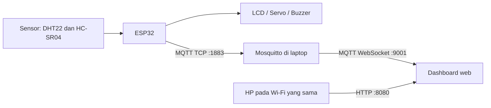

# sediaAkuSebelumBanjir

Proyek IoT mitigasi banjir berbasis **ESP32** untuk memantau jarak dari permukaan air, suhu, dan kelembapan. Sistem menyalakan alarm serta mengatur servo otomatis ketika objek berada terlalu dekat, lalu mengirim status ke MQTT. Data dapat dilihat dan buzzer dapat di-*mute* melalui dashboard web di jaringan Wi-Fi lokal.

## Fitur

- Membaca suhu dan kelembapan dengan **DHT22**.
- Membaca jarak dengan sensor ultrasonik **HC-SR04**.
- Menampilkan jarak, status alarm, suhu, dan kelembapan pada LCD I2C 16x2.
- Menggerakkan servo ke 90° saat objek berjarak kurang dari 20 cm.
- Mengontrol posisi servo dengan potensiometer saat kondisi aman.
- Mengaktifkan buzzer/relay *low-level trigger* saat alarm aktif.
- Mute buzzer melalui tombol fisik atau MQTT.
- Mengirim telemetri JSON ke MQTT setiap 2 detik.
- Menampilkan telemetri dan kontrol mute melalui dashboard web lokal.

## Arsitektur



## Komponen

| Komponen | Jumlah | Keterangan |
|---|---:|---|
| ESP32 DevKit | 1 | Board utama |
| DHT22 | 1 | Sensor suhu dan kelembapan |
| HC-SR04 | 1 | Sensor jarak ultrasonik |
| LCD I2C 16x2 | 1 | Alamat umum `0x27` |
| Servo | 1 | Servo 5 V, misalnya SG90 |
| Potensiometer | 1 | Untuk kontrol manual servo |
| Buzzer atau modul relay buzzer | 1 | Kode menggunakan logika aktif-LOW |
| Push button | 1 | Tombol mute buzzer |
| Resistor 1 kΩ dan 2 kΩ | masing-masing 1 | Pembagi tegangan untuk ECHO HC-SR04 |
| Catu daya 5 V eksternal | 1 | Direkomendasikan untuk servo |

## Rangkaian ESP32

| Komponen | Pin komponen | Pin ESP32 | Catatan |
|---|---|---:|---|
| DHT22 | DATA | GPIO 4 | Tambahkan pull-up 10 kΩ jika memakai sensor DHT22 tanpa modul. |
| HC-SR04 | TRIG | GPIO 5 | Keluaran 3,3 V dari ESP32 umumnya dapat terbaca oleh HC-SR04. |
| HC-SR04 | ECHO | GPIO 18 | **Wajib lewat pembagi tegangan**, karena ECHO adalah 5 V. |
| Servo | Signal | GPIO 19 | Gunakan supply 5 V eksternal untuk servo. |
| Potensiometer | Pin tengah | GPIO 34 | Kedua ujung potensiometer ke 3,3 V dan GND. |
| Buzzer / relay | IN | GPIO 14 | Kode menganggap modul aktif saat LOW. |
| Tombol | Salah satu kaki | GPIO 13 | Kaki tombol lainnya ke GND; memakai `INPUT_PULLUP`. |
| LCD I2C | SDA | GPIO 21 | |
| LCD I2C | SCL | GPIO 22 | |

### Catatan keselamatan rangkaian

- Sambungkan semua **GND** (ESP32, sensor, supply servo) menjadi satu.
- Jangan hubungkan ECHO HC-SR04 langsung ke GPIO 18. Rangkai: `ECHO → 1 kΩ → GPIO 18`, lalu dari GPIO 18 hubungkan resistor `2 kΩ → GND`. Tegangan 5 V akan turun menjadi kira-kira 3,3 V.
- Jangan menyalakan servo dari pin 3,3 V ESP32. Servo dapat menyebabkan ESP32 reset ketika menarik arus tinggi.
- Jika LCD I2C diberi 5 V dan memiliki pull-up I2C ke 5 V, gunakan level shifter I2C atau beri LCD 3,3 V jika modul tetap bekerja.

## Persiapan Arduino IDE

1. Instal Arduino IDE.
2. Buka **File > Preferences**.
3. Tambahkan URL berikut pada **Additional Boards Manager URLs**:

   ```text
   https://espressif.github.io/arduino-esp32/package_esp32_index.json
   ```

4. Buka **Tools > Board > Boards Manager**, cari `esp32`, lalu instal **esp32 by Espressif Systems**.
5. Pilih board **ESP32 Dev Module** pada **Tools > Board**.
6. Instal library berikut dari **Sketch > Include Library > Manage Libraries**:

   - `DHT sensor library` oleh Adafruit
   - `Adafruit Unified Sensor`
   - `LiquidCrystal I2C`
   - `ESP32Servo`
   - `PubSubClient` oleh Nick O'Leary

7. Hubungkan ESP32 dengan kabel USB **data**. Pada Windows, pilih port COM di **Tools > Port**.

> Jika port tidak tampil dan Device Manager menunjukkan `CP2102 USB to UART Bridge Controller` dengan tanda kuning, instal driver resmi [CP210x VCP Driver](https://www.silabs.com/software-and-tools/usb-to-uart-bridge-vcp-drivers). Setelah terpasang, perangkat akan muncul sebagai `Silicon Labs CP210x USB to UART Bridge (COMx)`.

## Konfigurasi firmware ESP32

Sebelum mengunggah sketch, sesuaikan kredensial Wi-Fi dan alamat IP laptop yang menjalankan Mosquitto:

```cpp
const char* WIFI_SSID = "NAMA_WIFI_2.4G";
const char* WIFI_PASSWORD = "PASSWORD_WIFI";

const char* MQTT_SERVER = "192.168.110.156";
const int MQTT_PORT = 1883;
```

ESP32 klasik hanya mendukung Wi-Fi 2,4 GHz. Laptop boleh berada pada band 5 GHz selama kedua perangkat masih berada pada LAN/router yang sama dan tidak memakai jaringan *Guest*.

### Topik MQTT

| Arah | Topik | Isi |
|---|---|---|
| ESP32 → broker | `rumah/esp32/alarm/status` | Status sensor dalam JSON |
| Dashboard → ESP32 | `rumah/esp32/alarm/cmd/mute` | `ON` untuk mute, `OFF` untuk mengaktifkan alarm lagi |

Contoh data status:

```json
{
  "suhu": 28.5,
  "kelembapan": 70.0,
  "jarak": 15.4,
  "alarm": true,
  "mute": false
}
```

> DHT22 sebaiknya dibaca minimal setiap 2 detik. Jarak dapat tetap diperbarui lebih cepat, misalnya tiap 500 ms.

## Menjalankan broker Mosquitto di Windows

1. Instal [Eclipse Mosquitto](https://mosquitto.org/download/).
2. Buat folder `C:\mqtt`.
3. Buat file `C:\mqtt\mosquitto.conf` dengan isi berikut:

   ```conf
   # Koneksi ESP32 menggunakan MQTT TCP
   listener 1883
   allow_anonymous true

   # Koneksi dashboard browser menggunakan MQTT over WebSocket
   listener 9001
   protocol websockets
   allow_anonymous true
   ```

4. Buka PowerShell dan jalankan:

   ```powershell
   & "C:\Program Files\mosquitto\mosquitto.exe" -c C:\mqtt\mosquitto.conf -v
   ```

Biarkan jendela tersebut tetap terbuka selama sistem dijalankan. Pengaturan `allow_anonymous true` hanya untuk pengujian pada LAN pribadi—jangan mengekspos port MQTT ke internet.

### Menguji broker

Buka PowerShell kedua untuk memantau pesan dari ESP32:

```powershell
& "C:\Program Files\mosquitto\mosquitto_sub.exe" -h localhost -t "rumah/esp32/alarm/#" -v
```

Kirim perintah mute untuk menguji kontrol:

```powershell
& "C:\Program Files\mosquitto\mosquitto_pub.exe" -h localhost -t "rumah/esp32/alarm/cmd/mute" -m "ON"
```

Gunakan payload `OFF` untuk mengaktifkan buzzer kembali.

## Menjalankan dashboard web

Dashboard HTML harus memakai alamat WebSocket broker berikut:

```javascript
const BROKER_URL = "ws://192.168.110.156:9001";
```

Jalankan web server dari folder yang memuat `dashboard.html`:

```powershell
cd C:\mqtt
py -m http.server 8080 --bind 0.0.0.0
```

Jika `py` tidak tersedia, coba perintah berikut:

```powershell
python -m http.server 8080 --bind 0.0.0.0
```

Lalu buka dashboard pada laptop atau HP yang berada di Wi-Fi yang sama:

```text
http://192.168.110.156:8080/dashboard.html
```

Jika Windows meminta izin Firewall untuk Python, pilih **Allow access** untuk jaringan **Private**. Jika dashboard terbuka tetapi status MQTT gagal, izinkan koneksi TCP port `9001` pada Windows Firewall.

> Browser hanya dapat terhubung ke MQTT melalui WebSocket (`ws://` atau `wss://`), bukan langsung ke port MQTT TCP `1883`. Karena itu dashboard memakai port `9001`.

## Menggunakan Serial Monitor

1. Upload sketch ke ESP32.
2. Buka **Tools > Serial Monitor** atau tekan `Ctrl + Shift + M`.
3. Atur kecepatan ke **115200 baud**.
4. Tekan tombol **EN/RST** di ESP32 bila Serial Monitor kosong.

Contoh keluaran yang diharapkan:

```text
Menghubungkan MQTT... berhasil
{"suhu":28.5,"kelembapan":70.0,"jarak":15.4,"alarm":true,"mute":false}
```

## Checklist pengujian

- [ ] ESP32 muncul sebagai port COM di Arduino IDE.
- [ ] Sketch berhasil di-upload tanpa error.
- [ ] Serial Monitor pada 115200 baud menampilkan koneksi MQTT berhasil.
- [ ] Perintah `mosquitto_sub` menerima pesan `rumah/esp32/alarm/status`.
- [ ] Menaruh objek kurang dari 20 cm mengaktifkan alarm dan servo berpindah ke 90°.
- [ ] Tombol fisik atau MQTT payload `ON` mematikan buzzer.
- [ ] Saat jarak kembali minimal 20 cm, kondisi mute di-reset dan servo kembali ke mode potensiometer.
- [ ] Dashboard menampilkan data yang berubah dan dapat dibuka dari HP.

## Troubleshooting

| Masalah | Penyebab umum | Solusi |
|---|---|---|
| Port tidak muncul di Arduino IDE | Kabel hanya charging atau driver CP2102 belum ada | Ganti kabel data dan instal CP210x VCP Driver. |
| Upload berhenti di `Connecting...` | ESP32 tidak masuk mode flash | Tahan tombol **BOOT** saat proses upload dimulai, lalu lepas ketika upload berjalan. |
| ESP32 gagal tersambung Wi-Fi | SSID/password salah atau Wi-Fi hanya 5 GHz | Periksa kredensial dan gunakan SSID 2,4 GHz. |
| MQTT gagal tersambung | IP laptop berubah, Mosquitto berhenti, atau port 1883 diblokir | Jalankan `ipconfig`, perbarui `MQTT_SERVER`, lalu jalankan Mosquitto lagi. |
| Dashboard terbuka tetapi tidak ada data | Port WebSocket 9001 belum aktif atau firewall memblokirnya | Periksa `mosquitto.conf`, restart Mosquitto, dan izinkan TCP 9001. |
| HP tidak dapat membuka dashboard | Web server Python berhenti, IP berubah, atau HP di jaringan Guest | Pastikan PowerShell web server masih terbuka dan gunakan Wi-Fi utama yang sama. |
| Nilai DHT22 kosong/NaN | Kabel/pull-up salah atau pembacaan terlalu cepat | Periksa kabel dan baca DHT22 setiap minimal 2 detik. |
| ESP32 reset ketika servo bergerak | Supply servo kurang kuat | Gunakan 5 V eksternal untuk servo dan satukan GND. |
| Jarak membuat ESP32 bermasalah | ECHO HC-SR04 langsung ke GPIO | Gunakan pembagi tegangan 1 kΩ dan 2 kΩ. |

## Keamanan dan pengembangan lanjutan

Versi ini ditujukan untuk pembelajaran dan LAN pribadi. Sebelum digunakan pada jaringan yang lebih luas:

- Ganti akses anonim dengan username/password Mosquitto.
- Gunakan TLS (`mqtts://` dan `wss://`) bila dashboard diakses melalui internet.
- Batasi topik MQTT dengan ACL.
- Beri laptop IP statis atau DHCP reservation supaya alamat broker tidak berubah.
- Gunakan supply yang memadai dan enclosure untuk perangkat yang dipakai permanen.

## Referensi

- [Instalasi Arduino-ESP32 — Espressif](https://docs.espressif.com/projects/arduino-esp32/en/latest/installing.html)
- [Konfigurasi Mosquitto listener/WebSocket](https://mosquitto.org/man/mosquitto-conf-5.html)
- [MQTT.js untuk browser](https://github.com/mqttjs/MQTT.js/blob/main/README.md)
